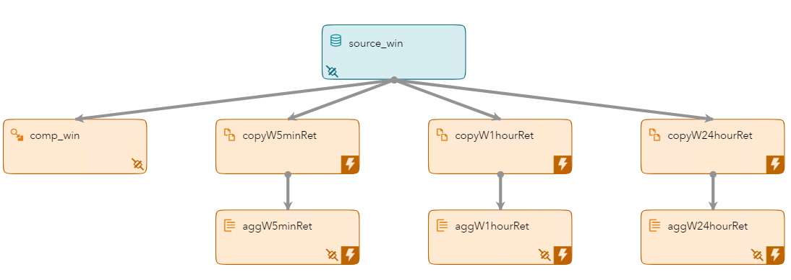
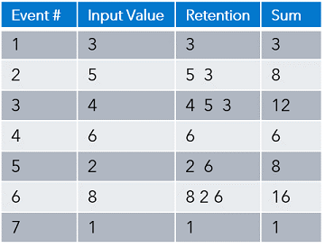
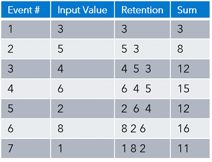

# Event Retention and Calculating Throughput

In this repository, you'll learn how to retain events and how to calculate the event throughput rate using SAS Event Stream Processing (ESP) 6.2.

## What You Will Learn

* How to use a Copy window to retain events
* How to write user-defined functions and execute them in a Compute window
* How Aggregate windows function when receiving input from a Copy window

**Editing with ESP Studio**

 

**Editing with a Text Editor**


**Executing and Subscribing**


## Overview

The Event Retention and Calculating Throughput model is an XML model included in the examples that are installed with SAS Event Stream Processing (ESP) 6.2. It includes a source, compute, three copy, and three aggregate windows that perform various tasks on the stream.

### Model Diagram

The following is a model diagram of the Event Retention and Calculating Throughput model:



### 1. Data Source Window

There is a single source window named source_win. The window inputs the transactional records using an input data connector.


### 2. Compute Window

Compute windows take the input stream and create an output stream using computational manipulation. New output field values are created using expressions, user-defined functions, or plug-in functions. This model uses a user-defined function to calculate throughput rate.

#### User-Defined Functions

User-defined functions contain two parts. An initializer function executes when the model starts and the main portion of the function executes each time an event passes through the stream.

The following code initializes the function by creating variables and setting their initial value:

```
integer tradeCnt;
tradeCnt=0; 
date starttime; 
integer def; 
starttime=Today()
```

This is the code that executes each time an event passes through the stream:

```tradeCnt=tradeCnt+1; 
def=(Today()-starttime) * 86400; 
if (def != 0) 
	return tradeCnt/def;
```

The function included in the example contains a mistake. The line of code, def=Today()-starttime; needs to be corrected to be def=(Today()-starttime) * 86400;. This converts the number of seconds to an integer.

The compute window includes an output data connector that creates file compute.csv.

### 3. Copy Windows

There are three copy windows that retain events based on a retention technique. The retained events are then passed to the aggregate windows.

#### Event Retention

There are two types of retention, time-based and volume-based. Time-based retention uses either the system clock or embedded time values to determine the retention period. Volume-based retention uses the number of events.

There are two variants, sliding and jumping. Sliding retains the x most recent events after the threshold is reached. Jumping clears each time the threshold is reached.

The following tables includes two examples. Example 1 uses bycount_sliding retention with a value of 3, while example 2 uses bycount_jumping retention with a value of 3. You can see the difference once the fourth event arrives.

  

### 4. Aggregate Windows

There are three aggregate windows, each tied to one of the copy windows. The aggregate windows are identical. The difference is the input stream which is controlled by the retention values in the copy windows. Each aggregate window has an output data connector to create a csv file of the output.

This repository includes the files required to execute the example. You can edit the model if you like. Also included are video demonstrations that include the following topics:
* Viewing and editing the model using a text editor
* Viewing and editing the model in SAS ESP Studio 
* Executing the model using the SAS ESP XML Server and subscribing to the output using SAS ESP Streamviewer.

### Prerequisites

SAS Event Stream Processing 6.2

## Getting Started

All required files are included in the SAS ESP Examples directory ($DFESP_HOME/examples). Create a server copy of the model.xml and trades1M.csv files, and a local copy of model.xml for editing.

1.	Copy the files from the SAS ESP Examples directory for this example ($DFESP_HOME/examples/xml/vwap_xml) to a directory to which you have write access. Example:
	
```bash
cp $DFESP_HOME/examples/xml/vwap_xml/*.* /home/sasdemo/vwap
```

2.	Download the model.xml file to your local computer so it can be easily edited.

### Running

The following are instructions for executing the Event Retention and Calculating Throughput model. You must edit the model to include full paths for all data connectors and correct a mistake in the throughput calculation, at a minimum. You can make additional changes if you like. For instructions on using SAS ESP Studio to edit the model refer to the [Retention_Throughput_Instructions](https://gitlab.sas.com/IOT/event-retention-and-calculating-throughput/blob/master/docs/Retention_Throughput_Instructions.docx) document.

The following high-level tasks are performed to execute the model:
•	Edit the Model
•	Start the Model on the XML Server
•	Download and View CSV Files
•	Subscribe to the Output with SAS ESP Streamviewer

#### 1. View and Edit the Model with a Text Editor

Use the following steps to view and edit the model.xml model in a text editor.

1.	Edit the input data connector on the `source-win` window and the four output data connectors to include the full path to the files as follows:

    a.	Locate the `connector` element for the `source-win` source window and edit the `fsname` attribute to include the full path to your copy of Trades1M.csv. Example:
    
    `<property name='fsname'>/home/sasdemo/vwap/trades1M.csv</property>`

    b.	Locate the `connector` element for the `comp-win` compute window and edit the `fsname` attribute to include the full path to where compute.csv will be written. Example:
    
    `<property name='fsname'>/home/sasdemo/vwap/compute.csv</property>`

    c.	Locate the `connector` element for the `aggW5minRet` aggregate window and edit the `fsname` attribute to include the full path to where aggregate_5m.csv will be written. Example:
    
    `<property name='fsname'>/home/sasdemo/vwap/aggregate_5m.csv</property>`

    d.	Locate the `connector` element for the `aggW1hourRet` aggregate window and edit the `fsname` attribute to include the full path to where aggregate_1h.csv will be written. Example:
    
    `<property name='fsname'>/home/sasdemo/vwap/aggregate_1h.csv</property>`

    e.	Locate the `connector` element for the `aggW24hourRet` aggregate window and edit the `fsname` attribute to include the full path to where aggregate_24h.csv will be written. Example:
    
    `<property name='fsname'>/home/sasdemo/vwap/aggregate_24h.csv</property>`

2.	Edit the `field-expr` element on the `comp_win` compute window to correct the mistake in the user-defined function:
	
	`<field-expr>tradeCnt=tradeCnt+1; def=(Today()-starttime)*86400; if (def != 0) return tradeCnt/def;</field-expr>`

3.	Optional. Add a `rate` property to the `connector` element of the `source-win` source window to slow the events per second rate to 1000. Example:

	`<property name='rate'>1000</property>`

4.	Save your changes and upload the model to the appropriate server directory.

#### 2. Start the Model on the XML Server

Use the following command line syntax to start the trades.xml model on the XML server:

```bash
$DFESP_HOME/bin/dfesp_xml_server -model file:///*yourpath*/model.xml -http 61001 -pubsub 61002
```

where

* `$DFESP_HOME/bin/dfesp_xml_server` is the command to start the XML server
* `-model file:///*yourpath*/model.xml` specifies the full path to the model
* `-http 61001` specifies the http port
* `-pubsub 61002` specifies the pubsub port


#### 3.	Download and View the CSV Files Created

There are four csv files written to the directory you specified when you edited the model. You can download them to your local computer and view them.

#### 4.	Subscribe to the Output with SAS ESP Streamviewer

Use the following high-level steps to subscribe to the four output windows using SAS ESP Streamviewer. For more detailed steps, refer to the  [Retention_Throughput_Instructions](https://gitlab.sas.com/IOT/event-retention-and-calculating-throughput/blob/master/docs/Retention_Throughput_Instructions.docx) document.

1.	Ensure the model is running on the ESP XML server.
2.	Start SAS ESP Streamviewer using the following URL:
```
    https://Streamviewer-host-name/SASEventStreamProcessingStreamviewer
```
3.	Click the Show Model button to access the ESP Model Viewer.
4.	Click the aggW5minRet window to select it and the click Add Updating Subscriber.
5.	Click the aggW1hourRet window to select it and the click Add Updating Subscriber.
6.	Click the aggW24hourRet window to select it and the click Add Updating Subscriber.
7.	Click the compute window to select it and the click Add Streaming Subscriber.
8.	Click Close to close the ESP Model Viewer. A table of values from the four windows are displayed.

## Contributing

> We welcome your contributions! Please read [CONTRIBUTING.md](CONTRIBUTING.md) for details on how to submit contributions to this project. 

## License

> This project is licensed under the [Apache 2.0 License](LICENSE).

## Additional Resources

* [SAS Event Stream Processing 6.2 Product Documentation](https://go.documentation.sas.com/?cdcId=espcdc&cdcVersion=6.2&docsetId=espov&docsetTarget=home.htm&locale=en)